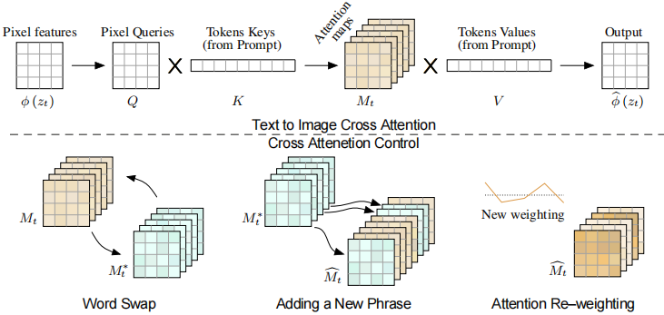
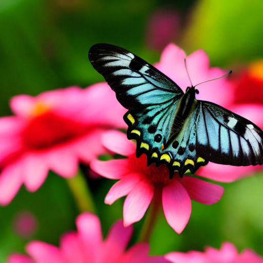

# Prompt-to-Prompt
Implementation of [Prompt-to-Prompt Image Editing with Cross Attention Control](https://arxiv.org/abs/2208.01626)

```shell
pip install diffusers==0.14.0 transformers==4.26.0
python edit.py
```


